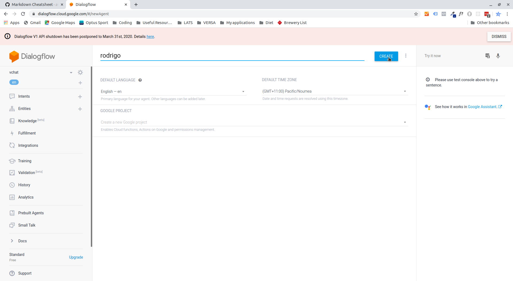
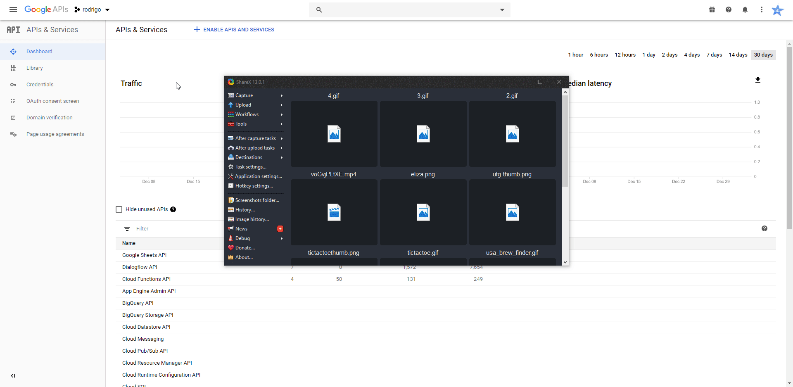
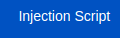

# Getting <%= chatbotName %> Set up.
### This guide will help you setup your chatbot, once setup you will easily be able to change it's design and content. Use live preview in VS code or your favourite text editor to view the helpful gifs below.

## Set up <%= chatbotName %>- Dialogflow.

*  Go to [Dialogflow](https://www.dialogflow.com), log in and select create new agent. Type in <%= chatbotName %> or what you want to call the agent and click create.



## Set up <%= chatbotName %> Backend.

* cd into the folder and run *npm install* or *yarn install* whichever you prefer.

``` terminal
cd backend

yarn install or npm install
```

* Head to https://console.developers.google.com/apis/dashboard?project=YOUR_PROJECT_ID_HERE. Click credentials > create credentials > service account key. Make a new service account called dialogflow-client and give it the role of *Dialogflow API Client*. Download the JSON file and keep it somewhere safe OUTSIDE your project folders. 



* open the JSON file and copy and paste the **project id, private key and client email** into the appropriate fields in the **.env** file. Also insert your language e.g en-AU or en-US and session ID which you can make up e.g <%= chatbotName %>-session.

## Testing 

* To test run the following command: 

```  terminal
yarn dev

or 

npm dev 
```

* You can then use postman to test the http://localhost:5000/api/df_text_query route with the following JSON. 

```JSON
{
	"text": "hi",
	"userId": "asdi123214"
}
```

* You can also test the to test the http://localhost:5000/api/df_event_query route with the following JSON. 

```JSON
{
	"event": "Welcome",
	"userId": "asdi123214"
}
```

## Set up <%= chatbotName %>-frontend.

* cd into the frontend folder and run *npm install* or *yarn install* whichever you prefer.

``` terminal
cd frontend

yarn install or npm install
```

* Replace the public/img/logo.png file with your own 100*100 pixel logo.

* Replace the public/favicon.ico with your own 16*16 pixel icon. 

* To edit the appearance of the chatbot you can change the css variables in the src/style-variables.scss file and also write your own custom scss if required.


## Deployment of <%= chatbotName %>.

* In the root folder of the project you will find your bitbucket-pipelines file. This will deploy both your frontend and backend on commit to master and production branches. 

* Log into bitbucket pipelines and create a new repository. 
* Click **Repository settings**, under pipelines click **settings** and then **enable Pipelines**.
* Click **Repository Variables**.
*  You will need to make sure that all the repository key and value pairs used in the project are set here. 

```.env

GOOGLE_CLIENT_EMAIL= {email from your dialogflow integrations service account}
GOOGLE_PRIVATE_KEY= {private key from your dialogflow integrations service account}
GOOGLE_PROJECT_ID= {project id from your dialogflow integrations service account}
DIALOGFLOW_SESSION_ID=<%= chatbotName %>-session
DIALOGFLOW_SESSION_LANGUAGE_CODE={your dialogflow project's language code e.g: en}
AWS_SECRET_ACCESS_KEY={your aws secret access key}
AWS_ACCESS_KEY_ID={your aws access key id}

```

* Once all keys are setup you can make your initial commit to master. You can then check the pipeline deployment to make sure it deploys correctly.

* Once deployed open the src/helpers/variables.js file and change the deployedURL to what you were given by your deployment. IT is important the make sure that the deployed URL ends with forward slash '/'. e.g "https://<%= chatbotName %>ts.r.appspot.com/", you can always change this back to local host if you are still developing.

* You can also change the apiURL in this file to the route you are given by your google app engine deployment. 

## Copy your injection script and add your chatbot to any website. 

* Once your frontend is deployed you will have an injection script button at the top of your chatbot. This will only appear on your deployment, not locally and not if the injection script is being used on an alternate site. 



* Click this button and your custom injection script will be copied to your clipboard and vchat will give you instructions on how to use it. 

* If the injection script button is not appearing go to src > helpers > variables.js and make sure the url is in the correct format with a forward slash '/' at the end of the address e.g "https://<%= chatbotName %>ts.r.appspot.com/".

## Optional Strapi Integration

If you are using strapi to create your interaction model, you can follow the instructions in the readme file in the strapi folder. 